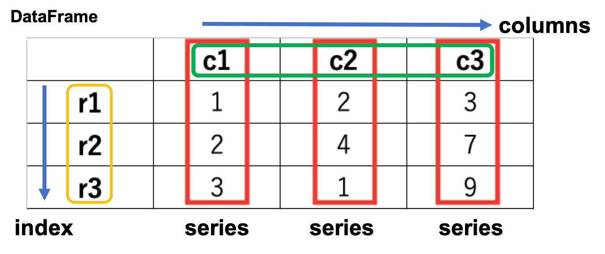

# Pandas入門

## 目次

 - Pandasとは
 - この章の目的と最終コード
 - データフレームの作成
 - データフレームに関する用語説明
 - データフレーム基礎操作・ファイルを読み込み
 - データフレーム基礎操作・新たな列の作成
 - データフレーム基礎操作・値の置換
 - データフレーム基礎操作・欠損値を埋める
 - データフレーム基礎操作・列の削除

## Pandasとは

Excelなどで使われるようなテーブル形式のデータをPythonで扱うためのライブラリです。

Pandasでは「データフレーム形式」というものを用いることで、高速かつ可読性の高い形でテーブルを扱うことができます。

ライブラリの読み込みは `import`構文で行うことができます。

 - ソースコード


```python
import pandas as pd # 出力なし
```

## この章の目的と最終コード

この章では、以下のテーブルをpandas経由で次のように変換してみます。

 - 変換前

|性別|年齢|兄弟姉妹|親子|生存|
|-|-|-|-|-|
|female|53|0|0|1|
|male|21|1|1|0|
|female|31|1|3|1|
|male|-|2|2|1|

 - 変換後
 
|性別|年齢|家族|生存|
|-|-|-|-|
|0|53|1|1|
|1|21|3|0|
|0|31|5|1|
|1|35|5|1|

このテーブルは次の章で使うTitanicのデータをものすごく小さくしたものです。

生存の列は1が生存を、0が非生存を表します。

年齢の列の-（ハイフン）は欠損値を表します。（欠損値については後述します）

最終コードは以下のようになっています。

 - ソースコード


```python
import numpy as np
import pandas as pd

df = pd.DataFrame({
    "性別": ["female", "male", "female", "male"],
    "年齢": [53, 21, 31, np.nan],
    "兄弟姉妹": [0, 1, 1, 2],
    "親子": [0, 1, 3, 2],
    "生存": [1, 0, 1, 1]
}, index=["1", "2", "3", "4"])

display(df) # 編集前のdataframeの出力

# 家族列を足す
df["家族"] = df["兄弟姉妹"] + df["親子"] + 1

# 性別列の置換
df["性別"] = df["性別"].replace({"female": 0, "male": 1})

# 年齢列のNaNを年齢の平均値で埋める
df["年齢"] = df["年齢"].fillna(df["年齢"].mean())

# 兄弟姉妹、親子列の削除
df.drop(["兄弟姉妹", "親子"], axis=1, inplace=True)

display(df) # 編集後のdataframeの出力
```


 - 出力
<table>
  <thead>
    <tr>
      <th></th>
      <th>兄弟姉妹</th>
      <th>年齢</th>
      <th>性別</th>
      <th>生存</th>
      <th>親子</th>
    </tr>
  </thead>
  <tbody>
    <tr>
      <th>1</th>
      <td>0</td>
      <td>53.0</td>
      <td>female</td>
      <td>1</td>
      <td>0</td>
    </tr>
    <tr>
      <th>2</th>
      <td>1</td>
      <td>21.0</td>
      <td>male</td>
      <td>0</td>
      <td>1</td>
    </tr>
    <tr>
      <th>3</th>
      <td>1</td>
      <td>31.0</td>
      <td>female</td>
      <td>1</td>
      <td>3</td>
    </tr>
    <tr>
      <th>4</th>
      <td>2</td>
      <td>NaN</td>
      <td>male</td>
      <td>1</td>
      <td>2</td>
    </tr>
  </tbody>
</table>


 - 出力
<table>
  <thead>
    <tr>
      <th></th>
      <th>年齢</th>
      <th>性別</th>
      <th>生存</th>
      <th>家族</th>
    </tr>
  </thead>
  <tbody>
    <tr>
      <th>1</th>
      <td>53.0</td>
      <td>0</td>
      <td>1</td>
      <td>1</td>
    </tr>
    <tr>
      <th>2</th>
      <td>21.0</td>
      <td>1</td>
      <td>0</td>
      <td>3</td>
    </tr>
    <tr>
      <th>3</th>
      <td>31.0</td>
      <td>0</td>
      <td>1</td>
      <td>5</td>
    </tr>
    <tr>
      <th>4</th>
      <td>35.0</td>
      <td>1</td>
      <td>1</td>
      <td>5</td>
    </tr>
  </tbody>
</table>


## データフレームの作成

`pd.Dataframe()` でデータフレームを作成することができます。

ここでは本番で使うデータをものすごーく小さくしたデータを作ってみます。

 - サンプルコード


```python
import numpy as np
import pandas as pd

df = pd.DataFrame({
    "性別": ["female", "male", "female", "male"],
    "年齢": [53, 21, 31, np.nan],
    "兄弟姉妹": [0, 1, 1, 2],
    "親子": [0, 1, 3, 2],
    "生存": [1, 0, 1, 1]
}, index=["1", "2", "3", "4"])

df
```


 - 出力
<table>
  <thead>
    <tr>
      <th></th>
      <th>兄弟姉妹</th>
      <th>年齢</th>
      <th>性別</th>
      <th>生存</th>
      <th>親子</th>
    </tr>
  </thead>
  <tbody>
    <tr>
      <th>1</th>
      <td>0</td>
      <td>53.0</td>
      <td>female</td>
      <td>1</td>
      <td>0</td>
    </tr>
    <tr>
      <th>2</th>
      <td>1</td>
      <td>21.0</td>
      <td>male</td>
      <td>0</td>
      <td>1</td>
    </tr>
    <tr>
      <th>3</th>
      <td>1</td>
      <td>31.0</td>
      <td>female</td>
      <td>1</td>
      <td>3</td>
    </tr>
    <tr>
      <th>4</th>
      <td>2</td>
      <td>NaN</td>
      <td>male</td>
      <td>1</td>
      <td>2</td>
    </tr>
  </tbody>
</table>


（`np.nan`は欠損値を作るための値です。ここではあまり気にする必要はありません。）

最後に`df`と打つことで、変数が見やすい形式で出力されていることがわかると思います。

キーを列名, バリューを値の配列として与えることで、新規データフレームを生成することができます。

なお、`df`という変数名は、データフレーム (data frame) というデータ構造の略語で、 <br>
dataframe型の変数にはdfという変数名がよく使用されます。

## データフレームに関する用語説明

index, column, Seriesについて説明します。

|用語|説明|
|-|-|
|index|行名のこと。`df.index`で行名を配列として取得できる。|
|column|列名のこと。`df.columns`で列名を配列として取得できる。|
|Series|Pandasにおける1次元データ構造のこと。SeriesがつながってDataFrameができている。|

イメージとしては以下です。



自分が扱っているデータ形式がデータフレームであるか、シリーズであるかは忘れやすいです。

エラーが起きたときには注意してみてください。

## データフレーム基礎操作・ファイルを読み込み

今回は辞書からデータフレームを作成しましたが、外部のファイルを読み込むこともできます。

（実際のKaggleでは、入力ファイルはほとんどの場合csvで与えられます。）

pandasにはCSVファイルを読み込むための関数（`pd.read_csv()`）が用意されています。

ここではGoogle Colaboratoryに用意されているサンプルデータを読み込みます。

 - サンプルコード


```python
df = pd.read_csv('sample_data/california_housing_train.csv')
df.head()
```


 - 出力
<table>
  <thead>
    <tr>
      <th></th>
      <th>longitude</th>
      <th>latitude</th>
      <th>housing_median_age</th>
      <th>total_rooms</th>
      <th>total_bedrooms</th>
      <th>population</th>
      <th>households</th>
      <th>median_income</th>
      <th>median_house_value</th>
    </tr>
  </thead>
  <tbody>
    <tr>
      <th>0</th>
      <td>-114.31</td>
      <td>34.19</td>
      <td>15.0</td>
      <td>5612.0</td>
      <td>1283.0</td>
      <td>1015.0</td>
      <td>472.0</td>
      <td>1.4936</td>
      <td>66900.0</td>
    </tr>
    <tr>
      <th>1</th>
      <td>-114.47</td>
      <td>34.40</td>
      <td>19.0</td>
      <td>7650.0</td>
      <td>1901.0</td>
      <td>1129.0</td>
      <td>463.0</td>
      <td>1.8200</td>
      <td>80100.0</td>
    </tr>
    <tr>
      <th>2</th>
      <td>-114.56</td>
      <td>33.69</td>
      <td>17.0</td>
      <td>720.0</td>
      <td>174.0</td>
      <td>333.0</td>
      <td>117.0</td>
      <td>1.6509</td>
      <td>85700.0</td>
    </tr>
    <tr>
      <th>3</th>
      <td>-114.57</td>
      <td>33.64</td>
      <td>14.0</td>
      <td>1501.0</td>
      <td>337.0</td>
      <td>515.0</td>
      <td>226.0</td>
      <td>3.1917</td>
      <td>73400.0</td>
    </tr>
    <tr>
      <th>4</th>
      <td>-114.57</td>
      <td>33.57</td>
      <td>20.0</td>
      <td>1454.0</td>
      <td>326.0</td>
      <td>624.0</td>
      <td>262.0</td>
      <td>1.9250</td>
      <td>65500.0</td>
    </tr>
  </tbody>
</table>


`df.head()` は読み込んだデータフレームの内、頭5行だけ表示するメソッドです。

データフレームが巨大なときは、とりあえず`df.head()`で見るとよいでしょう。

## データフレーム基礎操作・新たな列の作成

まず、「兄弟姉妹」と「親子」の列から、家族の人数を出してみます。

`df[列名] = 配列`で新たな列を作成することができます。

 - サンプルコード


```python
import pandas as pd
from IPython.display import display # 2つ以上DataFrameをNotebook上に出す用。実際のKaggleでは使用頻度は低い

# データの準備
df = pd.DataFrame({
    "性別": ["female", "male", "female", "male"],
    "年齢": [53, 21, 31, np.nan],
    "兄弟姉妹": [0, 1, 1, 2],
    "親子": [0, 1, 3, 2],
    "生存": [1, 0, 1, 1]
}, index=["1", "2", "3", "4"])
display(df)

# 新たな列の作成
df["家族"] = df["兄弟姉妹"] + df["親子"] + 1
display(df)
```


 - 出力
<table>
  <thead>
    <tr>
      <th></th>
      <th>兄弟姉妹</th>
      <th>年齢</th>
      <th>性別</th>
      <th>生存</th>
      <th>親子</th>
    </tr>
  </thead>
  <tbody>
    <tr>
      <th>1</th>
      <td>0</td>
      <td>53.0</td>
      <td>female</td>
      <td>1</td>
      <td>0</td>
    </tr>
    <tr>
      <th>2</th>
      <td>1</td>
      <td>21.0</td>
      <td>male</td>
      <td>0</td>
      <td>1</td>
    </tr>
    <tr>
      <th>3</th>
      <td>1</td>
      <td>31.0</td>
      <td>female</td>
      <td>1</td>
      <td>3</td>
    </tr>
    <tr>
      <th>4</th>
      <td>2</td>
      <td>NaN</td>
      <td>male</td>
      <td>1</td>
      <td>2</td>
    </tr>
  </tbody>
</table>


 - 出力
<table>
  <thead>
    <tr>
      <th></th>
      <th>兄弟姉妹</th>
      <th>年齢</th>
      <th>性別</th>
      <th>生存</th>
      <th>親子</th>
      <th>家族</th>
    </tr>
  </thead>
  <tbody>
    <tr>
      <th>1</th>
      <td>0</td>
      <td>53.0</td>
      <td>female</td>
      <td>1</td>
      <td>0</td>
      <td>1</td>
    </tr>
    <tr>
      <th>2</th>
      <td>1</td>
      <td>21.0</td>
      <td>male</td>
      <td>0</td>
      <td>1</td>
      <td>3</td>
    </tr>
    <tr>
      <th>3</th>
      <td>1</td>
      <td>31.0</td>
      <td>female</td>
      <td>1</td>
      <td>3</td>
      <td>5</td>
    </tr>
    <tr>
      <th>4</th>
      <td>2</td>
      <td>NaN</td>
      <td>male</td>
      <td>1</td>
      <td>2</td>
      <td>5</td>
    </tr>
  </tbody>
</table>


pandasは列方向の操作はしやすく、列名を直接指定して四則演算などをすることができます。

`df[列名]` は単体で出力するとSeriesが取り出されます。

実際に `df["親子"]` と打つと、「親子」の列が取り出されているのがわかります。

（`df["親子"]`の中身としては、上で説明したpandas.seriesが入っています。）

 - サンプルコード


```python
df["親子"]
```


    1    0
    2    1
    3    3
    4    2
    Name: 親子, dtype: int64


左側にindexが、右側に実際の値が並んで出力されていることがわかります。

## データフレーム基礎操作・値の置換

次に、「性別」列の値の置換をします。

[`df.replace(辞書)`](https://pandas.pydata.org/pandas-docs/stable/reference/api/pandas.DataFrame.replace.html) でデータフレーム内の値を置換することができます。

今回、「性別」列のみ置換ということを意識するため、「性別」列だけを抽出して置換してみます。

 - サンプルコード


```python
import pandas as pd
from IPython.display import display # 2つ以上DataFrameをNotebook上に出す用

# データの準備
df = pd.DataFrame({
    "性別": ["female", "male", "female", "male"],
    "年齢": [53, 21, 31, np.nan],
    "兄弟姉妹": [0, 1, 1, 2],
    "親子": [0, 1, 3, 2],
    "生存": [1, 0, 1, 1]
}, index=["1", "2", "3", "4"])
display(df)

# 実際の操作
df["性別"] = df["性別"].replace({"female": 0, "male": 1})
display(df)
```


 - 出力
<table>
  <thead>
    <tr>
      <th></th>
      <th>兄弟姉妹</th>
      <th>年齢</th>
      <th>性別</th>
      <th>生存</th>
      <th>親子</th>
    </tr>
  </thead>
  <tbody>
    <tr>
      <th>1</th>
      <td>0</td>
      <td>53.0</td>
      <td>female</td>
      <td>1</td>
      <td>0</td>
    </tr>
    <tr>
      <th>2</th>
      <td>1</td>
      <td>21.0</td>
      <td>male</td>
      <td>0</td>
      <td>1</td>
    </tr>
    <tr>
      <th>3</th>
      <td>1</td>
      <td>31.0</td>
      <td>female</td>
      <td>1</td>
      <td>3</td>
    </tr>
    <tr>
      <th>4</th>
      <td>2</td>
      <td>NaN</td>
      <td>male</td>
      <td>1</td>
      <td>2</td>
    </tr>
  </tbody>
</table>


 - 出力
<table>
  <thead>
    <tr>
      <th></th>
      <th>兄弟姉妹</th>
      <th>年齢</th>
      <th>性別</th>
      <th>生存</th>
      <th>親子</th>
    </tr>
  </thead>
  <tbody>
    <tr>
      <th>1</th>
      <td>0</td>
      <td>53.0</td>
      <td>0</td>
      <td>1</td>
      <td>0</td>
    </tr>
    <tr>
      <th>2</th>
      <td>1</td>
      <td>21.0</td>
      <td>1</td>
      <td>0</td>
      <td>1</td>
    </tr>
    <tr>
      <th>3</th>
      <td>1</td>
      <td>31.0</td>
      <td>0</td>
      <td>1</td>
      <td>3</td>
    </tr>
    <tr>
      <th>4</th>
      <td>2</td>
      <td>NaN</td>
      <td>1</td>
      <td>1</td>
      <td>2</td>
    </tr>
  </tbody>
</table>


「性別」列の値が置換されていることがわかると思います。

## データフレーム基礎操作・欠損値を埋める

機械学習に限らず、データを操作するときにつきものなのが、欠損値（データの欠け）です。

Pandasの機能を用いてこの欠損値を埋めてみます。

まず、どのような時に欠損値（NaN）ができるかを見てみます。

 - サンプルコード


```python
# ファイルを書き出す
f = open("_test_data.csv", "w")
f.write(",C1,C2,C3\n")
f.write("R1,1,2,3\n")
f.write("R2,2,,1\n")
f.write("R3,3,7,9\n")
f.close()
```

（上記スクリプトはテストデータを作るのが目的なので、深く理解する必要はありません）

左サイドバーに現れた`_test_data.csv`をクリックでも見ることはできますが、

ファイルの内容を確認することのできる`cat`コマンドで中身を見てみましょう。

 - サンプルコード


```python
!cat _test_data.csv
```

 - 出力
,C1,C2,C3
    R1,1,2,3
    R2,2,,1
    R3,3,7,9


（!を頭につけることで、bashのコマンドを打つこともできます）

上記のように、2行2列目が欠損値になっていることがわかると思います。

このファイルをpandasで読み込んでみます。

 - サンプルコード


```python
df = pd.read_csv("_test_data.csv", index_col=0)
df
```


 - 出力
<table>
  <thead>
    <tr>
      <th></th>
      <th>C1</th>
      <th>C2</th>
      <th>C3</th>
    </tr>
  </thead>
  <tbody>
    <tr>
      <th>R1</th>
      <td>1</td>
      <td>2.0</td>
      <td>3</td>
    </tr>
    <tr>
      <th>R2</th>
      <td>2</td>
      <td>NaN</td>
      <td>1</td>
    </tr>
    <tr>
      <th>R3</th>
      <td>3</td>
      <td>7.0</td>
      <td>9</td>
    </tr>
  </tbody>
</table>


R2, C2の値が NaNという値になっていることがわかると思います。

このように、外部ファイルの値が空になっている部分は `NaN` で埋められます。

実際のデータを年齢の平均値で埋めてみます。

 - サンプルコード


```python
import pandas as pd
from IPython.display import display # 2つ以上DataFrameをNotebook上に出す用

# データの準備
df = pd.DataFrame({
    "性別": ["female", "male", "female", "male"],
    "年齢": [53, 21, 31, np.nan],
    "兄弟姉妹": [0, 1, 1, 2],
    "親子": [0, 1, 3, 2],
    "生存": [1, 0, 1, 1]
}, index=["1", "2", "3", "4"])
display(df)

# 実際の操作
ave_age = df["年齢"].mean()
df["年齢"] = df["年齢"].fillna(ave_age)
display(df)
```


 - 出力
<table>
  <thead>
    <tr>
      <th></th>
      <th>兄弟姉妹</th>
      <th>年齢</th>
      <th>性別</th>
      <th>生存</th>
      <th>親子</th>
    </tr>
  </thead>
  <tbody>
    <tr>
      <th>1</th>
      <td>0</td>
      <td>53.0</td>
      <td>female</td>
      <td>1</td>
      <td>0</td>
    </tr>
    <tr>
      <th>2</th>
      <td>1</td>
      <td>21.0</td>
      <td>male</td>
      <td>0</td>
      <td>1</td>
    </tr>
    <tr>
      <th>3</th>
      <td>1</td>
      <td>31.0</td>
      <td>female</td>
      <td>1</td>
      <td>3</td>
    </tr>
    <tr>
      <th>4</th>
      <td>2</td>
      <td>NaN</td>
      <td>male</td>
      <td>1</td>
      <td>2</td>
    </tr>
  </tbody>
</table>


 - 出力
<table>
  <thead>
    <tr>
      <th></th>
      <th>兄弟姉妹</th>
      <th>年齢</th>
      <th>性別</th>
      <th>生存</th>
      <th>親子</th>
    </tr>
  </thead>
  <tbody>
    <tr>
      <th>1</th>
      <td>0</td>
      <td>53.0</td>
      <td>female</td>
      <td>1</td>
      <td>0</td>
    </tr>
    <tr>
      <th>2</th>
      <td>1</td>
      <td>21.0</td>
      <td>male</td>
      <td>0</td>
      <td>1</td>
    </tr>
    <tr>
      <th>3</th>
      <td>1</td>
      <td>31.0</td>
      <td>female</td>
      <td>1</td>
      <td>3</td>
    </tr>
    <tr>
      <th>4</th>
      <td>2</td>
      <td>35.0</td>
      <td>male</td>
      <td>1</td>
      <td>2</td>
    </tr>
  </tbody>
</table>


データフレームの値が年齢の平均値で埋められた様子がわかるかと思います。

`df["年齢"].mean()` については[おまけのPandas応用のページ](99_おまけ_Pandas応用.html#全体を集計) に記載しているので、そちらもご参照ください。

## データフレーム基礎操作・列の削除

「兄弟姉妹」と「親子」の列を削除してみます。

`df.drop([列名], axis=1, inplace=True)` で列を削除することができます。

`axis=1` は列方向の操作を表し、 `inplace=True`はdfを直接書き換える（破壊的メソッド）を表しています。

 - サンプルコード


```python
import pandas as pd
from IPython.display import display # 2つ以上DataFrameをNotebook上に出す用

# データの準備
df = pd.DataFrame({
    "性別": ["female", "male", "female", "male"],
    "年齢": [53, 21, 31, np.nan],
    "兄弟姉妹": [0, 1, 1, 2],
    "親子": [0, 1, 3, 2],
    "生存": [1, 0, 1, 1]
}, index=["1", "2", "3", "4"])
display(df)

# 実際の操作
df.drop(["兄弟姉妹", "親子"], axis=1, inplace=True)
display(df)
```


 - 出力
<table>
  <thead>
    <tr>
      <th></th>
      <th>兄弟姉妹</th>
      <th>年齢</th>
      <th>性別</th>
      <th>生存</th>
      <th>親子</th>
    </tr>
  </thead>
  <tbody>
    <tr>
      <th>1</th>
      <td>0</td>
      <td>53.0</td>
      <td>female</td>
      <td>1</td>
      <td>0</td>
    </tr>
    <tr>
      <th>2</th>
      <td>1</td>
      <td>21.0</td>
      <td>male</td>
      <td>0</td>
      <td>1</td>
    </tr>
    <tr>
      <th>3</th>
      <td>1</td>
      <td>31.0</td>
      <td>female</td>
      <td>1</td>
      <td>3</td>
    </tr>
    <tr>
      <th>4</th>
      <td>2</td>
      <td>NaN</td>
      <td>male</td>
      <td>1</td>
      <td>2</td>
    </tr>
  </tbody>
</table>


 - 出力
<table>
  <thead>
    <tr>
      <th></th>
      <th>年齢</th>
      <th>性別</th>
      <th>生存</th>
    </tr>
  </thead>
  <tbody>
    <tr>
      <th>1</th>
      <td>53.0</td>
      <td>female</td>
      <td>1</td>
    </tr>
    <tr>
      <th>2</th>
      <td>21.0</td>
      <td>male</td>
      <td>0</td>
    </tr>
    <tr>
      <th>3</th>
      <td>31.0</td>
      <td>female</td>
      <td>1</td>
    </tr>
    <tr>
      <th>4</th>
      <td>NaN</td>
      <td>male</td>
      <td>1</td>
    </tr>
  </tbody>
</table>


兄弟姉妹、親子の列が削除されていればOKです。

## おわりに

上記をまとめると、最終コードと同じ様になります。

 - 入力


```python
import numpy as np
import pandas as pd

df = pd.DataFrame({
    "性別": ["female", "male", "female", "male"],
    "年齢": [53, 21, 31, np.nan],
    "兄弟姉妹": [0, 1, 1, 2],
    "親子": [0, 1, 3, 2],
    "生存": [1, 0, 1, 1]
}, index=["1", "2", "3", "4"])

display(df) # 編集前のdataframeの出力

# 家族列を足す
df["家族"] = df["兄弟姉妹"] + df["親子"] + 1

# 性別列の置換
df["性別"] = df["性別"].replace({"female": 0, "male": 1})

# 年齢列のNaNを埋める
df["年齢"] = df["年齢"].fillna(df["年齢"].mean())

# 兄弟姉妹、親子列の削除
df.drop(["兄弟姉妹", "親子"], axis=1, inplace=True)

display(df) # 編集後のdataframeの出力
```


 - 出力
<table>
  <thead>
    <tr>
      <th></th>
      <th>兄弟姉妹</th>
      <th>年齢</th>
      <th>性別</th>
      <th>生存</th>
      <th>親子</th>
    </tr>
  </thead>
  <tbody>
    <tr>
      <th>1</th>
      <td>0</td>
      <td>53.0</td>
      <td>female</td>
      <td>1</td>
      <td>0</td>
    </tr>
    <tr>
      <th>2</th>
      <td>1</td>
      <td>21.0</td>
      <td>male</td>
      <td>0</td>
      <td>1</td>
    </tr>
    <tr>
      <th>3</th>
      <td>1</td>
      <td>31.0</td>
      <td>female</td>
      <td>1</td>
      <td>3</td>
    </tr>
    <tr>
      <th>4</th>
      <td>2</td>
      <td>NaN</td>
      <td>male</td>
      <td>1</td>
      <td>2</td>
    </tr>
  </tbody>
</table>


 - 出力
<table>
  <thead>
    <tr>
      <th></th>
      <th>年齢</th>
      <th>性別</th>
      <th>生存</th>
      <th>家族</th>
    </tr>
  </thead>
  <tbody>
    <tr>
      <th>1</th>
      <td>53.0</td>
      <td>0</td>
      <td>1</td>
      <td>1</td>
    </tr>
    <tr>
      <th>2</th>
      <td>21.0</td>
      <td>1</td>
      <td>0</td>
      <td>3</td>
    </tr>
    <tr>
      <th>3</th>
      <td>31.0</td>
      <td>0</td>
      <td>1</td>
      <td>5</td>
    </tr>
    <tr>
      <th>4</th>
      <td>35.0</td>
      <td>1</td>
      <td>1</td>
      <td>5</td>
    </tr>
  </tbody>
</table>


