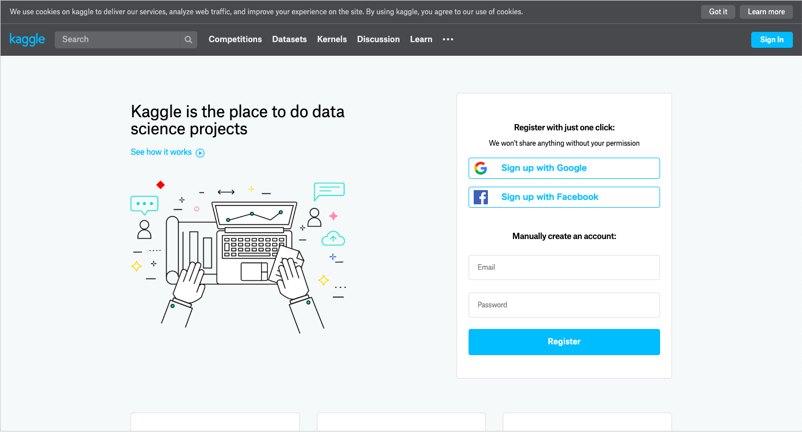
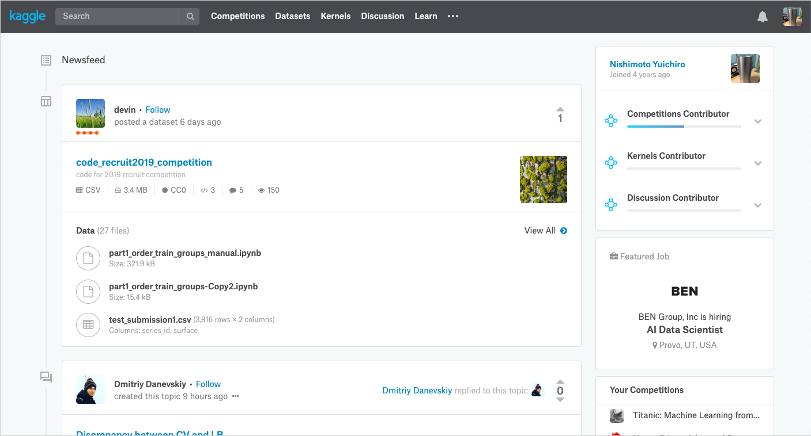
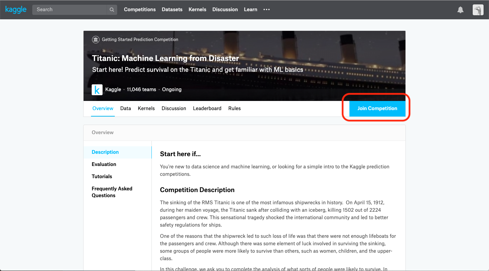
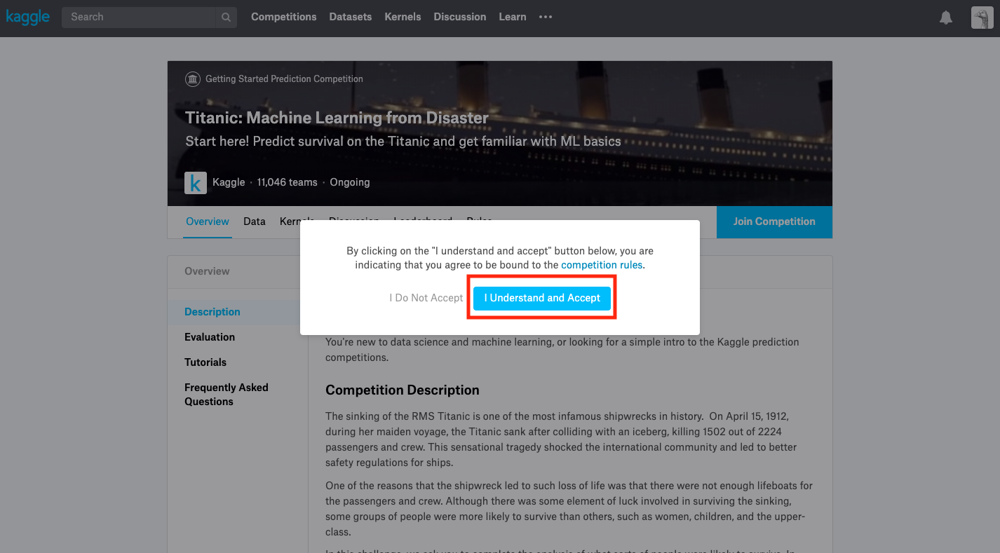
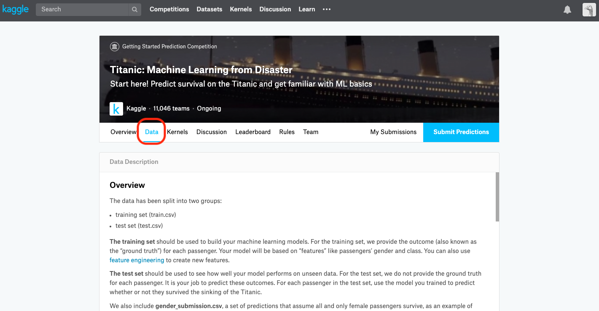
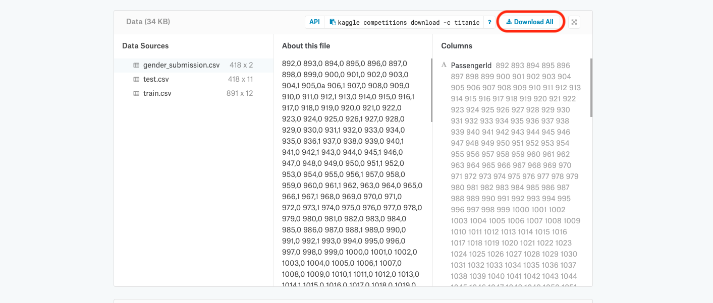

# Kaggleへ登録 〜 データダウンロード

## Kaggleへ登録

[Kaggleの公式ページ](https://www.kaggle.com/)へアクセスし、登録してください。

登録すると、以下のような画面になると思います。

## Join Competition

Kaggleでは、データダウンロードのためにはコンペティションに参加するボタンを押す必要があります。

今回はKaggleの登竜門的な存在である、[Titanicコンペ](https://www.kaggle.com/c/titanic)へ参加してみたいと思います。

Join Competition → I Understand and Accept で規約に同意し、コンペに参加しましょう。

## Kaggleの画面説明

各コンペのページには以下の7つのタブがあります。

それぞれのタブの意味としては以下のようになっています。

|タブの名前|説明|
|-|-|
|Overview|コンペの説明、データの説明など|
|Data|主にデータダウンロード|
|Kernels|他人が公開しているソースコード（Kernel）|
|Discussion|データに関する議論|
|Leaderboard|他の人や自分の提出した結果|
|Rules|コンペのルール（あまり使わない）|
|Team|複数人でチームを組むとき用のページ（今回は使わない）|

よく使うのはOverview, Data, Kernels, Discussion, Learderboardの5つです。

まずはDataタブからデータをダウンロードしてみます。

## データのダウンロード

データタブをクリックしたあと、画面の下の方にデータがあるので、ダウンロードしてみてください。

## おわりに

今回は短いですが、ここで終わりにします。

次回から実際に機械学習を試してみます。

