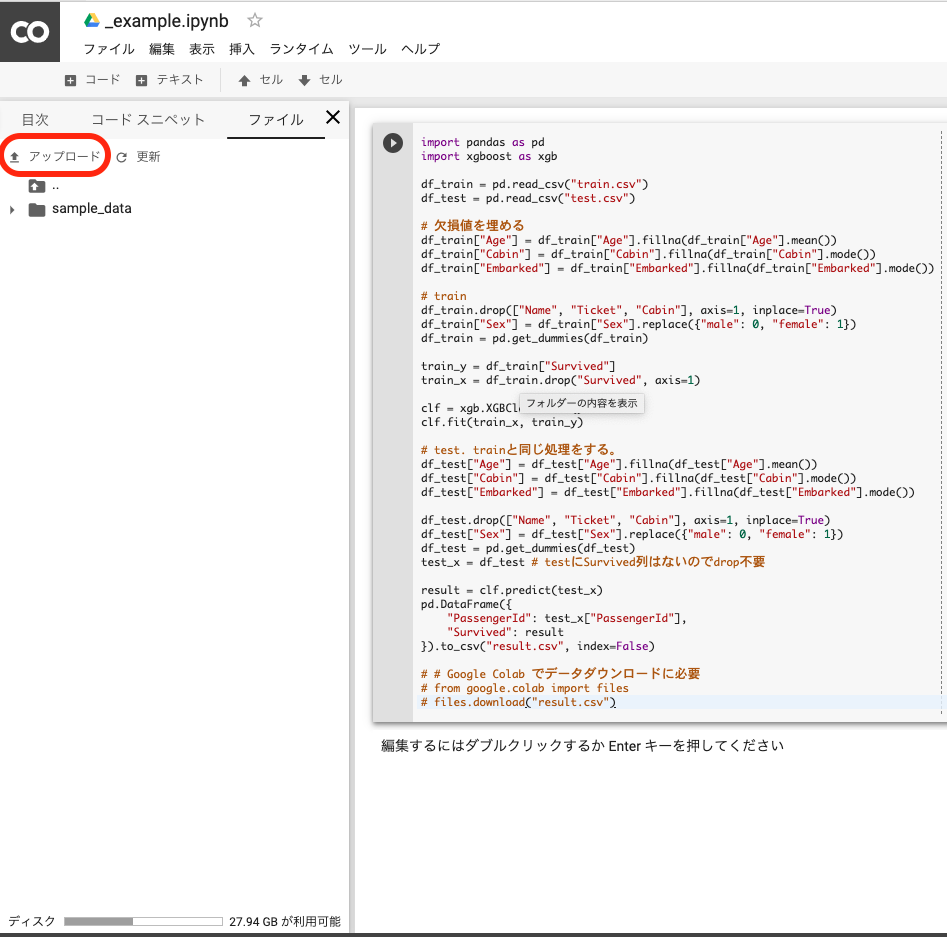
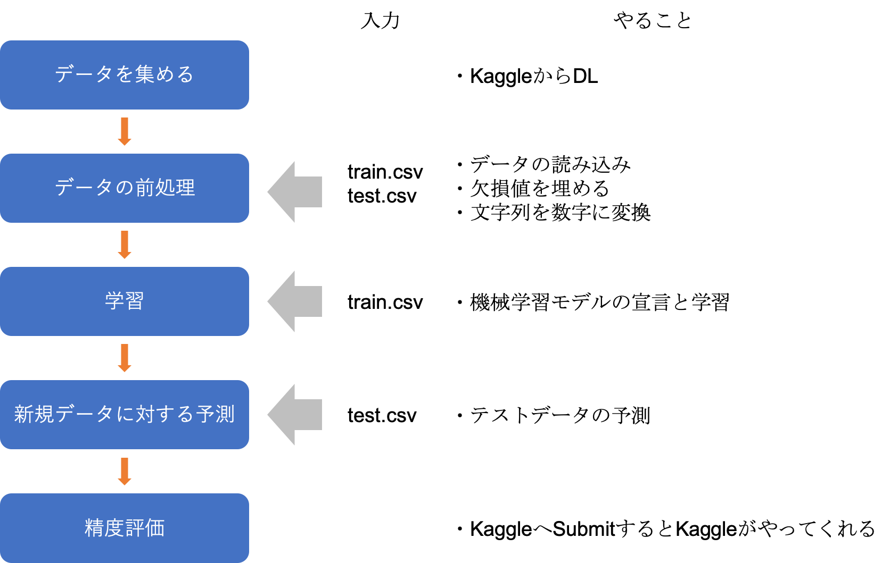
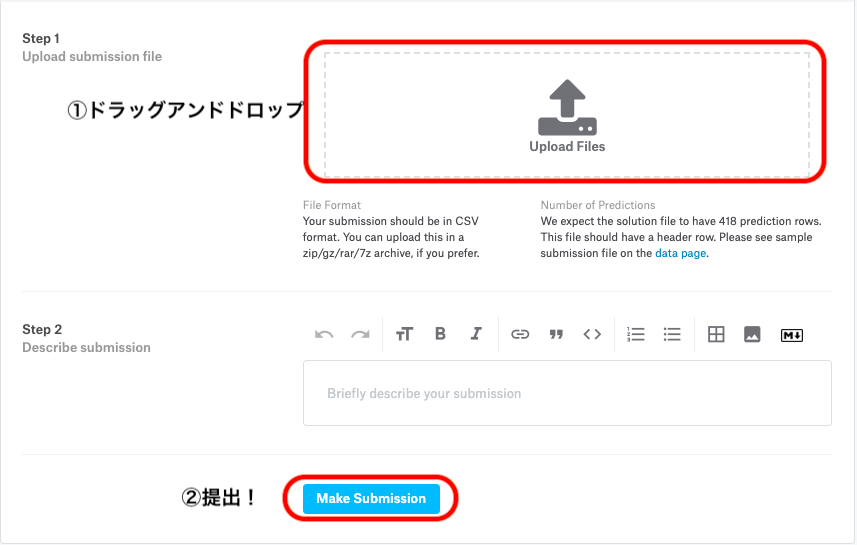

# とりあえず機械学習してみる

## 目次

 - この章の目的
 
 - データのアップロード
 
 - 最終コード
 
 - ソースコードの解説

  - データを読み込む & 眺める
 
  - 列名についての説明
  
  - これからやることの確認
 
  - 欠損値を埋める
 
  - 文字列を数字列に変換する
  
  - 説明変数、目的変数への分割
 
  - 機械学習アルゴリズムの宣言と学習
 
  - テストデータの予測
 
  - csvとして出力
 
 - おわりに

## この章の目的

「最短で機械学習プログラムを動かし、Kaggleへ結果を提出する」がこの章の目的です。

また、最短で動かす機械学習プログラムの解説も並行して進めます。

## データのアップロード

GoogleColabで外部データを扱う場合、データのアップロードが必要です。

左サイドバーのファイル → アップロードからアップロードすることができます。



前の章でダウンロードしたtrain.csvとtest.csvをGoogle Colabへアップロードします。

## 最終コード

まずは、この章で学ぶソースコードを以下に示します。

プログラムを動かして、`result.csv`をダウンロードする画面が出てきたらOKです。

 - ソースコード


```python
import warnings
import pandas as pd
import xgboost as xgb

warnings.filterwarnings("ignore") # 警告文無視用

df_train = pd.read_csv("train.csv")
df_test = pd.read_csv("test.csv")

# trainの前処理
df_train["Age"] = df_train["Age"].fillna(df_train["Age"].mean())
df_train["Cabin"] = df_train["Cabin"].fillna(df_train["Cabin"].mode()[0])
df_train["Embarked"] = df_train["Embarked"].fillna(df_train["Embarked"].mode()[0])
df_train.drop(["Name", "Ticket", "Cabin"], axis=1, inplace=True)
df_train["Sex"] = df_train["Sex"].replace({"male": 0, "female": 1})
df_train = pd.get_dummies(df_train)

# 説明変数、目的変数への分割
train_y = df_train["Survived"]
train_x = df_train.drop("Survived", axis=1)

# 機械学習アルゴリズムの宣言と学習
clf = xgb.XGBClassifier()
clf.fit(train_x, train_y)

# testの前処理
df_test["Age"] = df_test["Age"].fillna(df_test["Age"].mean())
df_test["Fare"] = df_test["Fare"].fillna(df_test["Fare"].mean())
df_test["Cabin"] = df_test["Cabin"].fillna(df_test["Cabin"].mode()[0])
df_test.drop(["Name", "Ticket", "Cabin"], axis=1, inplace=True)
df_test["Sex"] = df_test["Sex"].replace({"male": 0, "female": 1})
df_test = pd.get_dummies(df_test)
test_x = df_test # testにSurvived列はないのでdrop不要

# 予測
result = clf.predict(test_x)
pd.DataFrame({
    "PassengerId": test_x["PassengerId"],
    "Survived": result
}).to_csv("result.csv", index=False)

# Google Colab でデータダウンロードに必要
# from google.colab import files
# files.download("result.csv")
```

## データを読み込む & 眺める

まずはcsvファイルをpythonで扱うために、読み込みます。

そして、テーブルを読み込んだ際は、まずはデータを眺めてみます。

Jupyter Notebookでは、`データフレーム` または `データフレーム.head()` と打つことでデータフレームの中身を見ることができます。

 - ソースコード


```python
df_train = pd.read_csv("train.csv")
df_train.head()
```


 - 出力
<table>
  <thead>
    <tr>
      <th></th>
      <th>PassengerId</th>
      <th>Survived</th>
      <th>Pclass</th>
      <th>Name</th>
      <th>Sex</th>
      <th>Age</th>
      <th>SibSp</th>
      <th>Parch</th>
      <th>Ticket</th>
      <th>Fare</th>
      <th>Cabin</th>
      <th>Embarked</th>
    </tr>
  </thead>
  <tbody>
    <tr>
      <td>0</td>
      <td>1</td>
      <td>0</td>
      <td>3</td>
      <td>Braund, Mr. Owen Harris</td>
      <td>male</td>
      <td>22.0</td>
      <td>1</td>
      <td>0</td>
      <td>A/5 21171</td>
      <td>7.2500</td>
      <td>NaN</td>
      <td>S</td>
    </tr>
    <tr>
      <td>1</td>
      <td>2</td>
      <td>1</td>
      <td>1</td>
      <td>Cumings, Mrs. John Bradley (Florence Briggs Th...</td>
      <td>female</td>
      <td>38.0</td>
      <td>1</td>
      <td>0</td>
      <td>PC 17599</td>
      <td>71.2833</td>
      <td>C85</td>
      <td>C</td>
    </tr>
    <tr>
      <td>2</td>
      <td>3</td>
      <td>1</td>
      <td>3</td>
      <td>Heikkinen, Miss. Laina</td>
      <td>female</td>
      <td>26.0</td>
      <td>0</td>
      <td>0</td>
      <td>STON/O2. 3101282</td>
      <td>7.9250</td>
      <td>NaN</td>
      <td>S</td>
    </tr>
    <tr>
      <td>3</td>
      <td>4</td>
      <td>1</td>
      <td>1</td>
      <td>Futrelle, Mrs. Jacques Heath (Lily May Peel)</td>
      <td>female</td>
      <td>35.0</td>
      <td>1</td>
      <td>0</td>
      <td>113803</td>
      <td>53.1000</td>
      <td>C123</td>
      <td>S</td>
    </tr>
    <tr>
      <td>4</td>
      <td>5</td>
      <td>0</td>
      <td>3</td>
      <td>Allen, Mr. William Henry</td>
      <td>male</td>
      <td>35.0</td>
      <td>0</td>
      <td>0</td>
      <td>373450</td>
      <td>8.0500</td>
      <td>NaN</td>
      <td>S</td>
    </tr>
  </tbody>
</table>


 - ソースコード


```python
df_test = pd.read_csv("test.csv")
df_test.head()
```


 - 出力
<table>
  <thead>
    <tr>
      <th></th>
      <th>PassengerId</th>
      <th>Pclass</th>
      <th>Name</th>
      <th>Sex</th>
      <th>Age</th>
      <th>SibSp</th>
      <th>Parch</th>
      <th>Ticket</th>
      <th>Fare</th>
      <th>Cabin</th>
      <th>Embarked</th>
    </tr>
  </thead>
  <tbody>
    <tr>
      <td>0</td>
      <td>892</td>
      <td>3</td>
      <td>Kelly, Mr. James</td>
      <td>male</td>
      <td>34.5</td>
      <td>0</td>
      <td>0</td>
      <td>330911</td>
      <td>7.8292</td>
      <td>NaN</td>
      <td>Q</td>
    </tr>
    <tr>
      <td>1</td>
      <td>893</td>
      <td>3</td>
      <td>Wilkes, Mrs. James (Ellen Needs)</td>
      <td>female</td>
      <td>47.0</td>
      <td>1</td>
      <td>0</td>
      <td>363272</td>
      <td>7.0000</td>
      <td>NaN</td>
      <td>S</td>
    </tr>
    <tr>
      <td>2</td>
      <td>894</td>
      <td>2</td>
      <td>Myles, Mr. Thomas Francis</td>
      <td>male</td>
      <td>62.0</td>
      <td>0</td>
      <td>0</td>
      <td>240276</td>
      <td>9.6875</td>
      <td>NaN</td>
      <td>Q</td>
    </tr>
    <tr>
      <td>3</td>
      <td>895</td>
      <td>3</td>
      <td>Wirz, Mr. Albert</td>
      <td>male</td>
      <td>27.0</td>
      <td>0</td>
      <td>0</td>
      <td>315154</td>
      <td>8.6625</td>
      <td>NaN</td>
      <td>S</td>
    </tr>
    <tr>
      <td>4</td>
      <td>896</td>
      <td>3</td>
      <td>Hirvonen, Mrs. Alexander (Helga E Lindqvist)</td>
      <td>female</td>
      <td>22.0</td>
      <td>1</td>
      <td>1</td>
      <td>3101298</td>
      <td>12.2875</td>
      <td>NaN</td>
      <td>S</td>
    </tr>
  </tbody>
</table>


この時点でパッとわかることは

 - test.csvはSurvived列がないこと

　　（すぐ下で理由を解説します）

 - いくつかの列は数値が、いくつかの列は文字が入っていること

　　（文字列は基本的に機械学習モデルが学習できないため、数値に変換する必要がある）
 
 - NaNという文字が含まれている列があること
 
　　（[2章]()でも触れましたが、欠損値といいます。詳細は後述します。）
   
の３点です。

train.csvとtest.csvがありますが、それぞれ

<table>
	<tr>
		<td>train.csv</td>
		<td>機械学習に学習させる用のデータ</td>
	</tr>
	<tr>
		<td>test.csv</td>
		<td>機械学習に予測させる用のデータ</td>
	</tr>
</table>

です。

今回は、 **test.csvのSurvived**を予測せよ、というのが目的なので、Survived列がないのです。

（[Kaggleのページ（Goalの見出し）](https://www.kaggle.com/c/titanic/overview/evaluation)にもtestデータに対し0か1の予測値を返せと記載があります）

## 列名についての説明

列名に関してはたいていKaggleに説明があります。

[KaggleのTitanicのページ（Dataタブ）](https://www.kaggle.com/c/titanic/data) に列名の説明が載っています。

英語なので翻訳すると、以下のような感じでしょうか。

|列名|定義|値の意味|
|-|-|-|
|survival|生存したか否か|0 = 死亡, 1 = 生存|
|pclass|チケットのクラス|1 = 1st, 2 = 2nd, 3 = 3rd|
|sex|性別||
|Age|年齢||
|sibsp|（Titanic号に乗った）兄弟姉妹の数||
|parch|（Titanic号に乗った）親子の数||
|ticket|チケットの番号||
|fare|料金||
|cabin|客室番号||
|embarked|どこから乗ったか?|C = シェルブール, Q = クイーンズタウン, S = サウサンプトン|

データを眺めた後でもよいので、パラっと眺めることをオススメします。

## これからやることの確認

ここまでの復習と、ここからのタスクの確認のために、機械学習の全体的な流れの復習と、これからやることがどこに位置するかを模式図にしてみました。



データの読み込みは終わったので、引き続き前処理をやっていきます。

## 欠損値を埋める

### 欠損値の確認

`train.csv`のCabin列の1行目の値は **NaN** という値になっています。

これは欠損値といい、入力ファイルに値が存在しないとき、Pandasが勝手に入れてくれます。

まずは各列にNaNが含まれているかを確認します。

この処理は、trainデータとtestデータ両方でやることが大事です。

（trainデータには欠損値がないけど、testデータに欠損値がある、こともそこそこの頻度であるためです。）

 - ソースコード


```python
df_train = pd.read_csv("train.csv")
df_test = pd.read_csv("test.csv")

print("--train--")
for col in df_train.columns:
    if df_train[col].isnull().any():
        print(col, df_train[col].isnull().any())

print("--test--")
for col in df_test.columns:
    if df_test[col].isnull().any():
        print(col, df_test[col].isnull().any())

# df_train["Cabin"].head().isnull() # => 検証用。全ての行について判定していることがわかります。
```

 - 出力
--train--
    Age True
    Cabin True
    Embarked True
    --test--
    Age True
    Fare True
    Cabin True


`df[col].isnull()` で特定の列のすべての値にNaNが含まれているかを判定し、

`df[col].isnull().any()` で、その列の内1ヶ所以上にNaNが含まれているかを判定してくれます。

### 欠損値を埋める

trainデータはAge, Cabin, Embarked に欠損値があり、 testデータはAge, Fare, Cabinに欠損値があることがわかりました。

Age, Fareは平均値で埋め、CabinとEmbarkedは最頻値で埋めることにします。

`df["列名"] = df["列名"].fillna(値)` で特定の列の欠損値を埋めることができます。

なお、平均値は`df["列名"].mean()`で、最頻値は`df["列名"].mode()[0]`で、取得することができます。

 - ソースコード


```python
df_train["Age"] = df_train["Age"].fillna(df_train["Age"].mean())
df_train["Cabin"] = df_train["Cabin"].fillna(df_train["Cabin"].mode()[0])
df_train["Embarked"] = df_train["Embarked"].fillna(df_train["Embarked"].mode()[0])

df_test["Age"] = df_test["Age"].fillna(df_test["Age"].mean())
df_test["Fare"] = df_test["Fare"].fillna(df_test["Fare"].mean())
df_test["Cabin"] = df_test["Cabin"].fillna(df_test["Cabin"].mode()[0])

df_train.head()
# df_testは確認しませんが、同じように欠損値が埋められています。
```


 - 出力
<table>
  <thead>
    <tr>
      <th></th>
      <th>PassengerId</th>
      <th>Survived</th>
      <th>Pclass</th>
      <th>Name</th>
      <th>Sex</th>
      <th>Age</th>
      <th>SibSp</th>
      <th>Parch</th>
      <th>Ticket</th>
      <th>Fare</th>
      <th>Cabin</th>
      <th>Embarked</th>
    </tr>
  </thead>
  <tbody>
    <tr>
      <td>0</td>
      <td>1</td>
      <td>0</td>
      <td>3</td>
      <td>Braund, Mr. Owen Harris</td>
      <td>male</td>
      <td>22.0</td>
      <td>1</td>
      <td>0</td>
      <td>A/5 21171</td>
      <td>7.2500</td>
      <td>B96 B98</td>
      <td>S</td>
    </tr>
    <tr>
      <td>1</td>
      <td>2</td>
      <td>1</td>
      <td>1</td>
      <td>Cumings, Mrs. John Bradley (Florence Briggs Th...</td>
      <td>female</td>
      <td>38.0</td>
      <td>1</td>
      <td>0</td>
      <td>PC 17599</td>
      <td>71.2833</td>
      <td>C85</td>
      <td>C</td>
    </tr>
    <tr>
      <td>2</td>
      <td>3</td>
      <td>1</td>
      <td>3</td>
      <td>Heikkinen, Miss. Laina</td>
      <td>female</td>
      <td>26.0</td>
      <td>0</td>
      <td>0</td>
      <td>STON/O2. 3101282</td>
      <td>7.9250</td>
      <td>B96 B98</td>
      <td>S</td>
    </tr>
    <tr>
      <td>3</td>
      <td>4</td>
      <td>1</td>
      <td>1</td>
      <td>Futrelle, Mrs. Jacques Heath (Lily May Peel)</td>
      <td>female</td>
      <td>35.0</td>
      <td>1</td>
      <td>0</td>
      <td>113803</td>
      <td>53.1000</td>
      <td>C123</td>
      <td>S</td>
    </tr>
    <tr>
      <td>4</td>
      <td>5</td>
      <td>0</td>
      <td>3</td>
      <td>Allen, Mr. William Henry</td>
      <td>male</td>
      <td>35.0</td>
      <td>0</td>
      <td>0</td>
      <td>373450</td>
      <td>8.0500</td>
      <td>B96 B98</td>
      <td>S</td>
    </tr>
  </tbody>
</table>


欠損値が埋まっていることが確認できます。

ちゃんと確認したい場合は、さきほどのソースコードを打つと、先程と違い何も出力されないことがわかります。

 - ソースコード（再掲）

```python
print("--train--")
for col in df_train.columns:
    if df_train[col].isnull().any():
        print(col, df_train[col].isnull().any()) # 出力なし

print("--test--")
for col in df_test.columns:
    if df_test[col].isnull().any():
        print(col, df_test[col].isnull().any())　# 出力なし
```

## 文字列を数字列に変換する

機械学習のときは、基本的に数値型しか学習データに入れることができません。

ここでは見た限り、Name, Sex, Ticket, Cabin, Embarkedの列は数値型ではなく、文字列型のようです。

ここでは3通りの戦略で数値に変えます。

|列名|=>|作戦|
|-|-|-|
|Name, Ticket, Cabin|=>|列を削除する|
|Sex|=>|0, 1の値に変更する|
|Embarked|=>|ダミー変数化する|

 - ソースコード


```python
# drop（列の削除）
df_train.drop(["Name", "Ticket", "Cabin"], axis=1, inplace=True)

# 値を置換
df_train["Sex"] = df_train["Sex"].replace({"male": 0, "female": 1})

# ダミー変数化
df_train = pd.get_dummies(df_train)
```

### 列の削除

[2章]()でも勉強しましたが、`df.drop(列名, axis=1, inplace=True)` で特定の行を削除することができます。

`axis=1` は列の削除を表し、`inplace=True` は変数の中身を直接変更する（破壊的である）ことを表します。

### 値を置換（01へ変換）

こちらも[2章]()で勉強しましたが、`df.replace(辞書)` でデータフレーム内の値を置換することができます。

ここでは、男性を0、女性を1として置換しています。

### ダミー変数化

`pd.get_dummies(データフレーム)` でダミー変数化することができます。

ダミー変数化とはカテゴリカルなデータを数値のデータに変換する方法で、

各カテゴリの列を作り、その列に0か1の値を入れることで、数値に変換します。

以下、簡単な例を見てみます。

 - ソースコード


```python
import pandas as pd
from IPython.display import display # 表示用

df = pd.DataFrame({
    "category": ["A", "A", "B"],
    "columns1": [1, 2, 3],
    "columns2": [2, 4, 6]
})

print("ダミー変数化前")
display(df)

print("ダミー変数化後")
display(pd.get_dummies(df))
```

 - 出力
ダミー変数化前


 - 出力
<table>
  <thead>
    <tr>
      <th></th>
      <th>category</th>
      <th>columns1</th>
      <th>columns2</th>
    </tr>
  </thead>
  <tbody>
    <tr>
      <td>0</td>
      <td>A</td>
      <td>1</td>
      <td>2</td>
    </tr>
    <tr>
      <td>1</td>
      <td>A</td>
      <td>2</td>
      <td>4</td>
    </tr>
    <tr>
      <td>2</td>
      <td>B</td>
      <td>3</td>
      <td>6</td>
    </tr>
  </tbody>
</table>


    ダミー変数化後


 - 出力
<table>
  <thead>
    <tr>
      <th></th>
      <th>columns1</th>
      <th>columns2</th>
      <th>category_A</th>
      <th>category_B</th>
    </tr>
  </thead>
  <tbody>
    <tr>
      <td>0</td>
      <td>1</td>
      <td>2</td>
      <td>1</td>
      <td>0</td>
    </tr>
    <tr>
      <td>1</td>
      <td>2</td>
      <td>4</td>
      <td>1</td>
      <td>0</td>
    </tr>
    <tr>
      <td>2</td>
      <td>3</td>
      <td>6</td>
      <td>0</td>
      <td>1</td>
    </tr>
  </tbody>
</table>


category_Aとcategory_Bという列ができていること、元々のcategory列に対応していることがわかると思います。

## 説明変数、目的変数への分割

ここまでで、前処理は終わりです。

機械学習をするときは、説明変数（予測する元となる変数たち；学習のリソース）と目的変数（予測するもの）が必要です。

説明変数は `train_x` という変数に、目的変数は `train_y` という変数に入れられることが多いです。

ここではsurvivedが予測するもの（目的変数）なので、Survived列をtrain_yに代入し、それ以外の列をtrain_xに代入します。

```python
train_y = df_train["Survived"]
train_x = df_train.drop("Survived", axis=1) # 出力なし
```

## 機械学習アルゴリズムの宣言と学習

機械学習アルゴリズムの宣言と、学習をします。

 - ソースコード

```python
clf = xgb.XGBClassifier()
clf.fit(train_x, train_y) # 出力なし
```

1行目は使用する機械学習アルゴリズムを宣言しただけの状態であり、まだ学習は済んでいません。

今回は、勾配ブースティングとランダムフォレストというアルゴリズム両方を使用したライブラリ（XGBoost）を使用しています。

2行目で `clf.fit(x, y)` とすることで `clf`が学習済み状態（機械学習モデル）になります。

## テストデータの予測

学習するだけでは意味がないので、テストデータの予測をします。

`clf.predict(データフレーム)` で予測することができます。

 - ソースコード

```python
result = clf.predict(test_x) # 出力なし
```

## csvとして出力

出力のフォーマットは、[Kaggleのページ](https://www.kaggle.com/c/titanic/overview/evaluation)に書いてあります。

ここでは１列目にPassengerId、2列目にSurvived列が必要なため、そのように出力します。

```python
result = clf.predict(test_x)
pd.DataFrame({
    "PassengerId": test_x["PassengerId"],
    "Survived": result
}).to_csv("result.csv", index=False) # 出力なし
```

## おわりに

この章では、機械学習での基本的な流れをやりました。

再度復習すると、このような流れでした。

 - データ読み込み

 - 欠損値の処理

 - 文字列を数字に変換する

 - 学習 & 予測

ここまでで、KaggleへSubmitしてみます。

result.csvをダウンロードした上で、[Kaggle公式ページ](https://www.kaggle.com/c/titanic/submit)でSubmitしてみてください。

ドラッグアンドドロップでファイルをアップロードして、「Make Submission」ボタンを押せばOKです。



 - ソースコード

```python
from google.colab import files
files.download("result.csv")
```

精度が0.76555になっていたらOKです。

おつかれさまでした！！

次の章では、精度を上げるための仮説出しをやってみます。


```python

```

