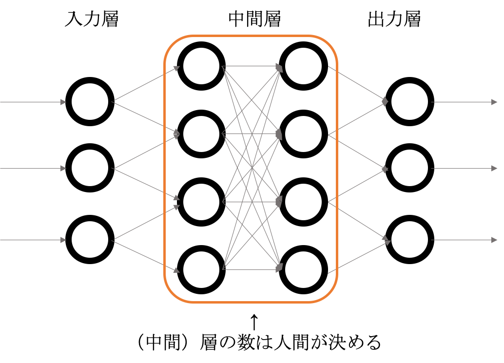

# 機械学習の精度を上げる（パラメーターチューニング）

## 目次

 - ハイパーパラメーターとは？
 - グリッドサーチによるパラメーターサーチ
 - ベイズ最適化によるパラメーターサーチ
 - スタッキングによる精度向上

## ハイパーパラメーターとは?

「機械学習アルゴリズムにおいて、人が調整するべきパラメーターのこと」です。

例えば、ディープラーニングにおける、層の数などがパラメーターに相当します。



今回は、2種類の手法でハイパーパラメータを探索します。

①：グリッドサーチ（いくつかの値の全組み合わせを試し、最適な値を探す）

②：ベイズ最適化によるパラメーターサーチ

②の方が使用されていることは多いですが、両方試してみます。

## 探索範囲について

私が使用しているパラメーター探索範囲は以下です。[公式のリファレンス](https://xgboost.readthedocs.io/en/latest/python/python_api.html#xgboost.XGBClassifier)も参照ください。

```python
all_params = {
    'max_depth': [3, 5, 7],
    'learning_rate': [0.01, 0.1],
    'min_child_weight': [3, 5, 10],
    'n_estimetors': [10000],
    'colsample_bytree': [0.8, 0.9, 1.0],
    'colsample_bylevel': [0.8, 0.9, 1.0],
    'reg_alpha': [0, 0.1],
    'random_state': [0],
    'n_jobs': [1],
}
```

## グリッドサーチによるパラメーターサーチ

(`sklearn.model_selection.ParameterGrid`)[https://scikit-learn.org/stable/modules/generated/sklearn.model_selection.ParameterGrid.html] に上記の辞書を与えると、全通りのパラメーターを作ってくれます。

以下は検証用のミニコード。

 - ソースコード


```python
from sklearn.model_selection import ParameterGrid
all_params = {
    'max_depth': [3, 5, 7],
    'learning_rate': [0.1],
    'min_child_weight': [3, 5, 10],
    'n_estimetors': [10000],
    'colsample_bytree': [0.8, 0.9, 1.0],
    'colsample_bylevel': [0.8, 0.9, 1.0],
    'reg_alpha': [0, 0.1],
    'random_state': [0],
    'n_jobs': [1],
}

for params in ParameterGrid(all_params):
    print(params)
    break # ここコメントアウトすると全部のパラメーターが出力されていることがわかります。
```

 - 出力
{'colsample_bylevel': 0.8, 'colsample_bytree': 0.8, 'learning_rate': 0.1, 'max_depth': 3, 'min_child_weight': 3, 'n_estimetors': 10000, 'n_jobs': 1, 'random_state': 0, 'reg_alpha': 0}


実際のソースコードで試してみます。

 - ソースコード


```python
%matplotlib inline
import warnings
import numpy as np
import pandas as pd
import xgboost as xgb
import matplotlib.pylab as plt

from sklearn.metrics import accuracy_score
from sklearn.model_selection import StratifiedKFold

# 組み合わせが多いので、進捗を可視化するツールを入れました。
from tqdm import tqdm_notebook as tqdm

warnings.filterwarnings('ignore')

# all_paramsはグローバル変数として宣言
all_params = {
    'max_depth': [3, 5, 7],
    'learning_rate': [0.1],
    'min_child_weight': [3, 5, 10],
    'n_estimetors': [10000],
    'colsample_bytree': [0.8, 0.9, 1.0],
    'colsample_bylevel': [0.8, 0.9, 1.0],
    'reg_alpha': [0, 0.1],
    'random_state': [0],
    'n_jobs': [1],
}


def validate(train_x, train_y, params):
    accuracies = []
    feature_importances = []

    cv = StratifiedKFold(n_splits=3, shuffle=True, random_state=0)
    for train_idx, test_idx in cv.split(train_x, train_y):
        trn_x = train_x.iloc[train_idx, :]
        val_x = train_x.iloc[test_idx, :]

        trn_y = train_y.iloc[train_idx]
        val_y = train_y.iloc[test_idx]

        clf = xgb.XGBClassifier(**params)
        clf.fit(trn_x, trn_y)

        pred_y = clf.predict(val_x)
        feature_importances.append(clf.feature_importances_)
        accuracies.append(accuracy_score(val_y, pred_y))
    return accuracies, feature_importances


def plot_feature_importances(feature_importances, cols):
    df_fimp = pd.DataFrame(feature_importances, columns=cols)
    df_fimp.plot(kind="box", rot=90)


def preprocess_df(df):
    # CabinはこのあとDropするので、コードから削除
    df["Age"] = df["Age"].fillna(df["Age"].mean())
    df["Embarked"] = df["Embarked"].fillna(df["Embarked"].mode())
    df["FamilySize"] = df["SibSp"] + df["Parch"] + 1
   
    # 列の削除
    df.drop(["Name", "Ticket", "Cabin", "PassengerId"], axis=1, inplace=True)

    # Sexの01化とEmbarkedのダミー化 
    df["Sex"] = df["Sex"].replace({"male": 0, "female": 1})
    df = pd.get_dummies(df)

    return df


# test dataのpredict
def predict_df(train_x, train_y, test_x, df_test_raw, path_output="result.csv"):
    params = {'learning_rate': 0.008306052798923729, 'max_depth': 7, 'min_child_weight': 3, 'colsample_bytree': 0.8210307463506532, 'colsample_bylevel': 0.8061816543590015}
    clf = xgb.XGBClassifier(**params)
    clf.fit(train_x, train_y)
    preds = clf.predict(test_x)
    
    _df = pd.DataFrame()
    _df["PassengerId"] = df_test_raw["PassengerId"]
    _df["Survived"] = preds
    _df.to_csv(path_output, index=False)


def main():
    df_train = pd.read_csv("train.csv")

    # ここは前処理
    train_y = df_train["Survived"]
    train_x = df_train.drop("Survived", axis=1)

    train_x = preprocess_df(train_x)
    accuracies, feature_importances = validate(train_x, train_y, {})
    plot_feature_importances(feature_importances, train_x.columns)

    flag_product = True
    if flag_product:
        df_test = pd.read_csv("test.csv")
        df_test_raw = df_test.copy()
        test_x = preprocess_df(df_test)
        predict_df(train_x, train_y, test_x, df_test_raw, "result.csv")

# main文を書き換えているので、別関数として定義
def main_parametersearch():
    df_train = pd.read_csv("train.csv")
    train_y = df_train["Survived"]
    train_x = df_train.drop("Survived", axis=1)
    train_x = preprocess_df(train_x)

    # ここまではmainと同じ
    # tqdmで囲むことで、進捗を可視化できます。
    best_score = 0
    best_params = {}
    for params in tqdm(ParameterGrid(all_params)):
        accuracies, feature_importances = validate(train_x, train_y, params)
        
        # もしaccuracyの平均値が最大だった場合、
        # best_scoreを更新して、best_paramsを更新する。
        if np.mean(accuracies) > best_score:
            best_score = np.mean(accuracies)
            best_params = params
    print(best_score, best_params)

# 呼んでいる関数を変えた
if __name__ == '__main__':
    main_parametersearch()
```


      0%|          | 0/162 [00:00<?, ?it/s]


    0.8316498316498316 {'colsample_bylevel': 0.8, 'colsample_bytree': 0.8, 'learning_rate': 0.1, 'max_depth': 7, 'min_child_weight': 5, 'n_estimetors': 10000, 'n_jobs': 1, 'random_state': 0, 'reg_alpha': 0}


元々のaccuracyより0.01ほど精度が上がっているのがわかると思います。

次に、ベイズ最適化によるパラメーターサーチを試してみます。

## ベイズ最適化によるパラメーターサーチ

ベイズ最適化はハイパーパラメーターをより効率的に探してくれるためのアルゴリズムです。

原理については[明治大の金子先生のページ](https://datachemeng.com/bayesianoptimization/)がわかりやすいです。

イメージとしては、 

①：よい精度を出したところを深く探索する

②：たまにハイパーパラメーターを全く変えて、もっと深いところがないか探索する

の2つを組み合わせることで最適なパラメーターを探索しています。

ここでは[PFNの人が作られたOptunaというライブラリー](https://optuna.org/)を使用します。

 -  ソースコード


```python
# !pip install optuna # ライブラリーのインストールコマンド
import optuna
import numpy as np
import pandas as pd
import xgboost as xgb

from tqdm import tqdm_notebook as tqdm
from IPython.display import display
from sklearn.metrics import accuracy_score
from sklearn.model_selection import StratifiedKFold


# optunaの出力をsupressする
# https://optuna.readthedocs.io/en/stable/faq.html#how-to-suppress-log-messages-of-optuna
optuna.logging.set_verbosity(optuna.logging.WARNING)

def objective(trial):
    params = {
        'seed': 0,
        'learning_rate': 0.1,
        'max_depth': trial.suggest_int('max_depth', 3, 7),
        'min_child_weight': trial.suggest_int('min_child_weight', 3, 10),
        'colsample_bytree': trial.suggest_loguniform('colsample_bytree', 0.8, 1.0),
        'colsample_bylevel': trial.suggest_loguniform('colsample_bylevel', 0.8, 1.0),
    }

    cv = StratifiedKFold(n_splits=3, shuffle=True, random_state=0)
    accuracies = []
    for train_idx, test_idx in cv.split(train_x, train_y):
        trn_x = train_x.iloc[train_idx, :]
        val_x = train_x.iloc[test_idx, :]

        trn_y = train_y.iloc[train_idx]
        val_y = train_y.iloc[test_idx]

        # main - Predict
        clf = xgb.XGBClassifier(**params)
        clf.fit(trn_x, trn_y)

        pred_y = clf.predict(val_x)
        accuracies.append(accuracy_score(val_y, pred_y))

    return 1.0 - np.mean(accuracies)


def preprocess_df(df):
    # CabinはこのあとDropするので、コードから削除
    df["Age"] = df["Age"].fillna(df["Age"].mean())
    df["Embarked"] = df["Embarked"].fillna(df["Embarked"].mode())
    df["FamilySize"] = df["SibSp"] + df["Parch"] + 1
   
    # 列の削除
    df.drop(["Name", "Ticket", "Cabin", "PassengerId"], axis=1, inplace=True)

    # Sexの01化とEmbarkedのダミー化 
    df["Sex"] = df["Sex"].replace({"male": 0, "female": 1})
    df = pd.get_dummies(df)

    return df


# main
df_train = pd.read_csv("train.csv")
train_y = df_train["Survived"]
train_x = df_train.drop("Survived", axis=1)
train_x = preprocess_df(train_x)

# random_stateを固定する
# 実際は要らないですが、今回はチュートリアルなので導入しています。
# https://optuna.readthedocs.io/en/stable/faq.html#how-can-i-obtain-reproducible-optimization-results
sampler = optuna.samplers.TPESampler(seed=100) # Make the sampler behave in a deterministic way.
study = optuna.create_study(sampler=sampler)
study.optimize(objective, n_trials=100, n_jobs=1)
print(study.best_trial.value)
print(study.best_trial.params)
```

 - 出力
0.16947250280583603
    {'max_depth': 4, 'min_child_weight': 7, 'colsample_bytree': 0.9780696556434307, 'colsample_bylevel': 0.9482914190554899}


optunaは使い方が少し特殊です。

基本的には

①：精度を返す関数を作る （`objective`関数）

②：その関数をOptunaに投げる　（`study.optimize`の引数に取る）
 
の2工程で対応できます。

詳細はソースコード + コメントをご参照ください。

最後に、実際にtest.csvも予測してみます。

 - ソースコード


```python
params = study.best_trial.params

def main():
    df_train = pd.read_csv("train.csv")

    train_y = df_train["Survived"]
    train_x = df_train.drop("Survived", axis=1)

    train_x = preprocess_df(train_x)
    accuracies, feature_importances = validate(train_x, train_y, params) # paramsに書き換えました。
    print(np.mean(accuracies))
    plot_feature_importances(feature_importances, train_x.columns)

    flag_product = True
    if flag_product:
        df_test = pd.read_csv("test.csv")
        df_test_raw = df_test.copy()
        test_x = preprocess_df(df_test)
        predict_df(train_x, train_y, test_x, df_test_raw, "result.csv")

if __name__ == "__main__":
    main()
```

 - 出力
0.830527497194164


## アンサンブルによる精度向上

機械学習において、**単一のモデルをそのまま使うのではなく、複数のモデルを組み合わせることで、精度を上げる**手法をアンサンブル学習といいます。

実際のKaggleではアンサンブルによる精度向上がかなり大きく、これだけである程度の順位を取ることができます。

ここでは、機械学習のアルゴリズムを2つ組み合わせて（LightGBMとXGBoost）、精度がよくなるかを見てみます。

 - ソースコード


```python
# 今回はクロスバリデーションで精度を出す以外のところは削っています。
import warnings
import numpy as np
import pandas as pd
import xgboost as xgb
import lightgbm as lgb

from sklearn.metrics import accuracy_score
from sklearn.model_selection import StratifiedKFold

warnings.filterwarnings('ignore')

# main文
df_train = pd.read_csv("train.csv")
train_y = df_train["Survived"]
train_x = df_train.drop("Survived", axis=1)

train_x = preprocess_df(train_x)

accuracies = []

cv = StratifiedKFold(n_splits=3, shuffle=True, random_state=0)
for train_idx, test_idx in cv.split(train_x, train_y):
    trn_x = train_x.iloc[train_idx, :]
    val_x = train_x.iloc[test_idx, :]

    trn_y = train_y.iloc[train_idx]
    val_y = train_y.iloc[test_idx]

    clf_xgb = xgb.XGBClassifier(**params)
    clf_lgb = lgb.LGBMClassifier(**params)

    clf_xgb.fit(trn_x, trn_y)
    clf_lgb.fit(trn_x, trn_y)
    
    # 平均値化するためにprobabilityを出した
    pred_proba_y_xgb = clf_xgb.predict_proba(val_x)[:, 1]
    pred_proba_y_lgb = clf_lgb.predict_proba(val_x)[:, 1]
    
    # probabilityの平均値が0.50を超えていれば1, そうでないなら0
    pred_proba_y = pd.DataFrame({"xgb": pred_proba_y_xgb, "lgb": pred_proba_y_lgb}).mean(axis=1)
    pred_y = [1 if proba > 0.50 else 0 for proba in pred_proba_y]
    accuracies.append(accuracy_score(val_y, pred_y))

print(np.mean(accuracies))
```

 - 出力
0.8327721661054994


XGBoost単体より少し精度が上がっていることがわかると思います。

今回は単純に平均値を取っただけですが、実際は複数の判別モデルから出力された値をさらに機械学習に入れ込むStackingなど、

様々な手法が取られています。

## おわりに

機械学習において、特徴量エンジニアリングの方がハイパーパラメーター探索より重要であることが多いです。

ただ、ハイパーパラメーターのチューニングも必要な技術ではあるので、一通りやってみました。

ここで概ね機械学習の講座は終わりです。 

ただ、まだまだ入り口であり、やることはたくさんあります。

ここでは、この次にやった方がよさそうなことをつらつらと書いていきます。

目的によって優先度は変わるので、ご自身で優先度を決めていただければと思いますが、

強いていうならばとりあえずコンペ参加がよいのではないでしょうか。

---

## 実際のコンペへ参加

実際のコンペへ参加し、Kernelを読み、discussionを読むということが総合的には１番勉強になります。

[KaggleのCompetitionsのページ](https://www.kaggle.com/competitions)から自分が向いてそうなコンペを探してみてください。

また、特徴量エンジニアリングという意味では最近でた本もオススメです。

なお、Kaggle以外のコンペサイトはKernelの共有などがないため最初は難しいと思います。。

参考：[Kaggle - Competitions](https://www.kaggle.com/competitions)

参考：[機械学習のための特徴量エンジニアリング](https://www.amazon.co.jp/dp/4873118689/)

---

## 機械学習アルゴリズムの把握

今回は流れの説明を優先したため、機械学習アルゴリズムの説明はしませんでした。

ただし、他人に説明するときなどはアルゴリズムの内容も把握している必要があるでしょう。

機械学習アルゴリズムの詳細は参考に挙げた本が詳細かつわかりやすく説明してくれています。

参考：[はじめてのパターン認識](https://www.amazon.co.jp/dp/4627849710)

---

## Kaggleで戦う環境を整える

Kaggleで本格的にコンペに参加するには、効率化を進める方がよいです。

### 計算機環境を整える

今回はあまり大きくないデータセットであったため、Google Colabでも計算ができましたが、

本格的なコンペはこれより１、２桁大きいデータセットであることが多いです。

そのようなときは、GCPなどのサーバー環境を借りて計算する方が自由に動けるのでオススメです。

参考：[GCPとDockerでKaggle用計算環境構築](https://qiita.com/lain21/items/a33a39d465cd08b662f1)

### Kaggle APIの登録

コマンドラインからKaggleにSubmitできるAPIを公式が準備してくれています。

GCPなどのサーバー環境を使うならば登録する方がベターです。

参考：[Kaggle/kaggle-api](https://github.com/Kaggle/kaggle-api)


```python

```

